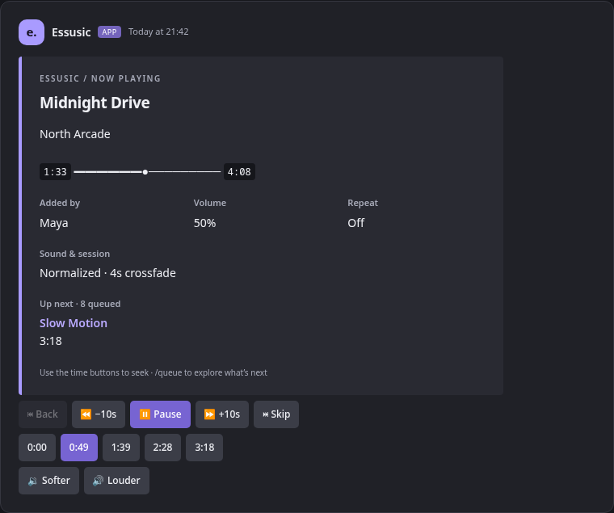
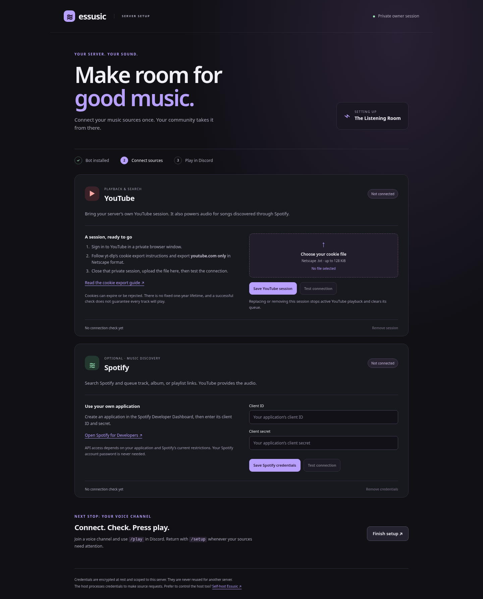

# Essusic

Essusic is a Discord music bot with an interactive player, separate queues, and owner-managed music sources for every server. Invite an existing instance, run `/setup`, and connect your own YouTube session and optional Spotify application. You can also self-host the entire bot.

Play YouTube and SoundCloud links, search for songs, or queue Spotify tracks, albums, and playlists. **Spotify supplies metadata; audio is found and played through YouTube**, so matches can differ from the original recording.

YouTube and YouTube Music song links play the selected track, even when shared with `list=LM` or another playlist parameter. To queue a whole playlist or album, use its `/playlist?list=…` or `/browse/…` link.

## Features

- **Owner-run setup** — Install first, then connect sources on a private setup page; credentials are encrypted and never shared between servers
- **Multi-source playback** — YouTube, Spotify (tracks/playlists/albums), SoundCloud, and radio streams
- **Interactive player** — A unified violet theme, labeled transport controls, timestamp seeking, artwork, and an up-next preview; refreshed at the bottom of the channel on track changes
- **Per-server queues** — Loop modes, smart shuffle, queue import/export, undo, and move/reorder
- **Audio controls** — Filters (bass boost, nightcore, vaporwave, 8D, karaoke), 10-band EQ with presets, speed control, loudness normalization, and crossfade
- **Radio mode** — Artist-seeded recommendations when the Spotify app has access to the required endpoints
- **Autoplay** — Automatically queues similar tracks when the queue runs out
- **Playlists** — Save/load server playlists with collaborator support
- **Favorites** — Per-user favorites that can be queued in one command
- **Search** — YouTube and Spotify search with a compact track selection menu
- **Ratings & stats** — Rate tracks, view top played, top rated, and personal/server listening stats
- **Lyrics** — Fetch lyrics for the current or any track
- **DJ mode** — Restrict destructive commands to a DJ role, or enable approval queue mode
- **Localization groundwork** — JSON locale loader and `/language`; English is the only bundled locale, and most responses are currently hard-coded
- **24/7 mode** — Stay connected to voice even when idle
- **Queue recovery** — Saves current and queued tracks to JSON; restored tracks are available when playback is started again
- **Dockerized** — Single-container deployment with docker compose

## Interface

The player, queue, search, libraries, lyrics, charts, help, and settings share a consistent card layout. Player states distinguish paused audio, live streams, and unknown durations. Long lists and lyrics use previous/next controls in a single message, while search uses a track selection menu. Expired menus are visibly disabled.



*Local preview using the actual embed and control builders. Discord determines the final typography, spacing, and button colors.*

To explore all 15 interface sections without connecting a bot:

```bash
python scripts/preview_ui.py
# Open build/ui-preview.html in your browser.
```

The gallery supports dark/light previews, compact width, help navigation, and sample pages. It uses fictional sample content and makes no network requests.

## Commands

### Playback
| Command | Description |
|---|---|
| `/play <query>` | Play from URL or search |
| `/playnext <query>` | Insert track to play next |
| `/skip` | Skip current track |
| `/back` | Play previous track |
| `/stop` | Stop, clear queue, disconnect |
| `/pause` / `/resume` | Pause or resume |
| `/replay` | Restart current track |
| `/voteskip` | Vote to skip (half the listeners, rounded up) |

### Queue
| Command | Description |
|---|---|
| `/queue` | Show queue (paginated) |
| `/myqueue` | Show your queued tracks |
| `/remove <pos>` | Remove track by position |
| `/move <from> <to>` | Reorder a track |
| `/skipto <pos>` | Jump to a position |
| `/clear` | Clear queue, keep current |
| `/shuffle` | Smart shuffle (avoids same-artist clusters) |
| `/undo` | Revert last queue change |
| `/queue-export` / `/queue-import` | Share queues as codes |

### Audio
| Command | Description |
|---|---|
| `/volume <1-100>` | Set volume |
| `/filter <name>` | Bass Boost, Nightcore, Vaporwave, 8D, Karaoke, None |
| `/seek <position>` | Seek (absolute `1:30` or relative `+30`/`-15`) |
| `/speed <0.5-2.0>` | Playback speed |
| `/normalize` | Toggle loudness normalization |
| `/eq <preset>` | EQ preset (Flat, Bass Heavy, Treble Heavy, Vocal, Electronic) |
| `/eqcustom <band> <gain>` | Adjust a single EQ band |
| `/crossfade <0-10>` | Crossfade between tracks (seconds) |

### Player & Info
| Command | Description |
|---|---|
| `/player` | Interactive player with buttons |
| `/nowplaying` | Current track with progress bar |
| `/loop` | Cycle loop mode: off / single / queue |
| `/autoplay` | Auto-queue similar tracks |
| `/lyrics [query]` | Fetch lyrics |
| `/grab` | DM current track info |
| `/help` | Browse commands by category |
| `/setup` | Owner-only source configuration and connection checks |
| `/invite` | Generate this bot’s server installation link |

### Search
| Command | Description |
|---|---|
| `/search <query>` | Search (YouTube or Spotify, per server setting) |
| `/youtube-search` / `/spotify-search` | Search a specific provider |
| `/searchmode` | Toggle default search provider |

### Favorites & Playlists
| Command | Description |
|---|---|
| `/fav` / `/unfav` / `/favs` | Manage favorites |
| `/playfavs` | Queue all your favorites |
| `/playlist save/load/delete/list` | Server playlists |
| `/playlist addtrack/removetrack` | Edit playlist tracks |
| `/playlist adduser/removeuser` | Manage collaborators |

### Radio & Recommendations
| Command | Description |
|---|---|
| `/radio <seed>` | Start radio by artist |
| `/radio-off` | Stop radio |
| `/similar` | Show similar tracks |

### Stats & Ratings
| Command | Description |
|---|---|
| `/top` / `/toprated` | Most played / highest rated |
| `/rate` | Rate current track |
| `/stats` / `/mystats` | Server or personal stats |

### Settings
| Command | Description |
|---|---|
| `/dj [role]` / `/djclear` / `/djmode` | DJ role and approval mode |
| `/maxqueue` / `/maxperuser` | Queue limits |
| `/setnpchannel` / `/clearnpchannel` | Dedicated now-playing channel |
| `/24-7` | Stay connected mode |
| `/language <lang>` | Server language |

## Setup

### For server owners

1. Invite an Essusic instance using its Discord installation link. `/invite` generates a link for the running instance.
2. As the **server owner**, run `/setup`. Open the private link in its ephemeral response. Administrators who are not the owner cannot manage credentials.
3. Upload a Netscape-format cookie file containing only your YouTube session. Follow [yt-dlp’s YouTube cookie export instructions](https://github.com/yt-dlp/yt-dlp/wiki/Extractors#exporting-youtube-cookies); do not upload a whole-browser export. Save, then test the connection.
4. Optionally enter your own Spotify application's client ID and secret from the [Spotify Developer Dashboard](https://developer.spotify.com/dashboard). Spotify supplies metadata; YouTube is still required for audio.
5. Join a voice channel and use `/play`. Run `/setup` again to check, replace, or remove credentials.

YouTube searches, links, playlists, and Spotify-derived playback require this server's YouTube configuration. SoundCloud and direct radio streams do not use YouTube credentials. There is no operator credential fallback, shared cookie file, or shared Spotify token cache.



*Actual setup UI with a synthetic server; [mobile preview](docs/setup-mobile-preview.png).*

### Host an instance

Requirements: Python 3.12+, FFmpeg, Node.js 22+ for [yt-dlp’s JavaScript support](https://github.com/yt-dlp/yt-dlp/wiki/EJS), and a Discord application/bot token. Docker includes these runtimes.

In the [Discord Developer Portal](https://discord.com/developers/applications), enable **Guild Install** and configure the `bot` and `applications.commands` scopes. Grant View Channel, Send Messages, Embed Links, Attach Files, Connect, and Speak in the channels the bot uses. Enable Public Bot if other owners should install your instance, and share its installation link. Privileged message-content access is not required.

```bash
git clone https://github.com/wleeaf/essusic.git
cd essusic
python3 -m venv .venv
source .venv/bin/activate
python -m pip install -r requirements.txt
cp .env.example .env
python -c 'import secrets,base64; print(base64.b64encode(secrets.token_bytes(32)).decode())'
# Set DISCORD_TOKEN and paste the generated key into CREDENTIALS_KEY in .env.
# Local setup: WEB_BASE_URL=http://localhost:8080
python bot.py
```

Keep the encryption key stable across restarts and back it up separately from `data/`. Losing it makes existing source credentials unreadable. Run from the repository root; saved settings, queues, libraries, and encrypted credentials default to `./data/`. `DATA_DIR` overrides this directory.

| Variable | Required | Purpose |
|---|---|---|
| `DISCORD_TOKEN` | Yes | Discord bot token |
| `CREDENTIALS_KEY` | For owner setup | Base64-encoded 32-byte encryption key, generated once |
| `WEB_BASE_URL` | For owner setup | Browser-facing HTTPS origin, e.g. `https://music.example.com`; no path. HTTP is accepted only on localhost/loopback |
| `WEB_PORT` | For owner setup or operator API | HTTP listener port, e.g. `8080` |
| `WEB_HOST` | No | Listener address; defaults to `127.0.0.1` |
| `WEB_API_TOKEN` | Only for operator API | Separate bearer token granting access to all guilds' operator endpoints |
| `DATA_DIR` | No | Defaults to `data` locally and `/data` in Docker |

For remote server owners, put an HTTPS reverse proxy in front of the HTTP listener and set `WEB_BASE_URL` to that exact origin. Forward the `/setup` path and its children without rewriting them; allow requests up to 256 KiB. Serve it on a dedicated origin and avoid logging request bodies, cookies, or authorization headers. Private setup links keep their initial token in the URL fragment, which is not sent in HTTP requests.

For a private self-hosted instance on a remote machine, keep `WEB_BASE_URL=http://localhost:8080` and use `ssh -L 8080:127.0.0.1:8080 your-host` while opening `/setup` links in your local browser. This does not expose setup publicly.

### Docker Compose

After configuring `.env`, start the bot with the web overlay:

```bash
docker compose -f docker-compose.yml -f compose.web.yml up -d --build
docker compose -f docker-compose.yml -f compose.web.yml logs -f bot
```

The overlay binds HTTP to **127.0.0.1:8080 on the host** and sets the listener inside the container to `0.0.0.0:8080`. Use a host reverse proxy for public HTTPS, or the SSH tunnel above for private setup. The base Compose file alone does not publish ports. `./data` is mounted at `/data`; leave `DATA_DIR` unset in `.env` to use that mount.

`deploy.sh <ssh-host>` updates an existing checkout at `/opt/essusic` and rebuilds with the web overlay. The target owns its `.env`, encryption key and stored data. The script does not export or copy browser cookies. If present, it includes the ignored `compose.host.yml` overlay for host-specific proxy networking. For a containerized proxy, use this overlay to attach the bot to the proxy’s external Docker network and route HTTPS to its network alias on port 8080. Keep this overlay on the host; it is excluded from Git and the image.

### Credential lifecycle and migration

- Initial links are single-use and expire in 5 minutes. Browser sessions expire after 15 minutes or logout; issuing a new `/setup` link revokes this server's previous sessions. Bot restarts revoke all setup links and sessions.
- The bot checks the current Discord owner on each setup request. It removes credentials on ownership transfer or bot removal, including reconciliation after reconnecting. New owners must configure their own sources.
- Credentials are authenticated-encrypted in `data/credentials/<guild-id>.enc`, bound to their server, with private filesystem permissions. Browser/API responses never return stored secrets. yt-dlp cookie jars and Spotify access-token caches remain in memory for their own requests/server.
- Removing or replacing YouTube credentials stops active YouTube playback and clears its queue. Already-running provider requests may finish, but stale YouTube extraction results cannot start playback. Deletion removes the active credential file; operators must manage retention of their own backups separately.
- Encryption protects stored files. The running host needs the key and plaintext credentials to make provider requests; self-host if you want to control that host yourself.
- **Upgrading:** global `SPOTIFY_CLIENT_ID`, `SPOTIFY_CLIENT_SECRET`, and `data/cookies.txt` are no longer read. Configure the setup service, then have each owner run `/setup`. Remove old shared secrets and token-cache files from your deployment once migrated. Existing queues, playlists and settings remain compatible.
- Cookies have no guaranteed one-year lifetime. They may expire, rotate, or be rejected; hosting IP restrictions still apply. The test resolves a sample video and tries a backup only when that video is unavailable. Authentication, rate-limit, and extraction failures produce specific messages. Selected audio streams are probed for download access before playback, so rejected formats can be skipped. A successful check does not verify a fixed expiry or every track. Some YouTube clients also need a [PO token](https://github.com/yt-dlp/yt-dlp/wiki/PO-Token-Guide); this version has no PO-token upload integration.

## Optional HTTP API

The operator JSON API is separate from owner setup. Set `WEB_PORT` and a strong `WEB_API_TOKEN` to enable it. Setup works without this token, in which case all `/api` requests are rejected. `/health` is public. All `/api` requests require `Authorization: Bearer <WEB_API_TOKEN>`; setup sessions do not grant operator access.

| Method | Path | Purpose |
|---|---|---|
| GET | `/health` | Process status and guild/shard counts |
| GET | `/api/guilds/{guild_id}/queue` | Current track, queue, and playback settings |
| POST | `/api/guilds/{guild_id}/skip` | Skip playing or paused audio |
| POST | `/api/guilds/{guild_id}/volume` | Set volume with JSON `{"level": 50}` (integer 1–100) |
| GET | `/api/guilds/{guild_id}/playlists` | Saved playlist summaries |
| GET | `/api/guilds/{guild_id}/stats` | Server play statistics |

The token is an operator credential, not a per-user Discord permission check. Keep the default loopback binding for local use. For container access, set `WEB_HOST=0.0.0.0` and explicitly publish the port; use HTTPS if exposing the API beyond a trusted local network.

Prometheus metrics are optional: install `prometheus-client` to start a metrics listener on port 9090. Metrics are not protected by the HTTP API token.

To exercise setup in a real browser using synthetic credentials and mocked providers:

```bash
python -m pip install playwright
python -m playwright install chromium
python scripts/check_setup_ui.py
```

## Behavior and limitations

- `/play` adds to the existing queue; it does not replace the current track or tracks restored after a restart. Single-track repeat keeps the current song playing until you `/skip` or change `/loop` mode. Queue confirmations warn when repeat is holding up your request.
- Spotify availability depends on the application's API access. Radio, autoplay, and `/similar` use related-artist/top-track endpoints; these may be unavailable under [Spotify's API restrictions](https://developer.spotify.com/blog/2024-11-27-changes-to-the-web-api).
- Recovery restores the interrupted track at the front of the queue. It does not reconnect to voice automatically or resume at the saved timestamp. `/stop` and automatic disconnect clear recovery state.
- History retains the latest 500 playback starts per server. Listening-time statistics use track durations, rather than measuring how long each listener actually listened.
- Crossfade requires a known track duration and a queued next track. It is disabled during single-track looping. Media availability and extraction can still fail upstream.
- `/24-7` keeps the bot connected while idle or alone. Otherwise it disconnects when left alone, or after five minutes of idle playback.

## Development

```bash
python -m unittest discover -s tests -v
python -m compileall -q bot.py cogs music web
```

The regression suite runs without Discord/Spotify credentials, network media access, or FFmpeg. It covers playback transitions, concurrent requests, queue recovery, URL parsing, server-bound encryption, provider isolation, credential revocation, owner setup sessions, CSRF checks, the operator API, and Discord component rendering. CI runs it on Python 3.12 and 3.14. Use [the manual test plan](test-todo.md) for real Discord voice playback and third-party integrations.

| Location | Responsibility |
|---|---|
| `bot.py` | Startup, command registration, optional HTTP/metrics services |
| `cogs/music_cog.py` | Slash commands, player UI, voice playback orchestration |
| `music/audio_source.py` | FFmpeg sources, filters, PCM crossfade |
| `music/providers.py` | Guild-scoped extraction, Spotify clients, connection checks and extraction backoff |
| `music/credentials.py` | Validated, encrypted source credentials and safe status |
| `music/queue_manager.py` | Per-server state and JSON-backed managers |
| `music/spotify_resolver.py` | Spotify metadata and recommendations |
| `music/url_parser.py` | Input classification |
| `music/config.py` | Shared storage paths |
| `music/presentation.py` | Shared cards, typography, progress, and pagination |
| `scripts/preview_ui.py` | Offline interface gallery generator |
| `web/app.py` | HTTP lifecycle and authenticated operator API |
| `web/setup.py`, `web/static/` | Owner sessions, source management and responsive setup UI |
| `scripts/check_setup_ui.py` | Offline browser smoke checks and setup screenshots |
| `tests/` | Automated regression tests |
